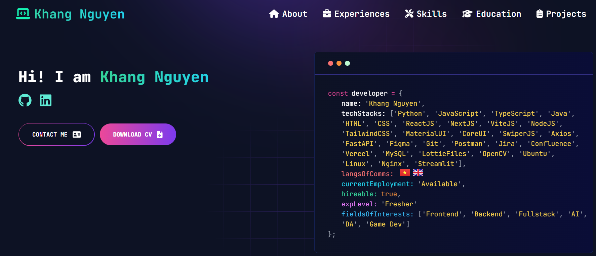

## Live preview: [npkhang.id.vn](https://npkhang.id.vn/)



---

## Table of Contents :scroll:

- [Sections](#sections-bookmark)
- [Demo](#demo-movie_camera)
- [Installation](#installation-arrow_down)
- [Getting Started](#getting-started-dart)
- [Usage](#usage-joystick)
- [Deployment](#deployment-rocket)
- [Packages Used](#packages-used-package)

---

# Sections :bookmark:

- Hero Section
- ABOUT ME
- Experience
- Tech Stacks (Skills)
- Projects
- Education
- Contacts

---

# Installation :arrow_down:

### You will need to download Git and Node to run this project

- [Git](https://git-scm.com/downloads)
- [Node](https://nodejs.org/en/download/)

#### Make sure you have the latest version of both Git and Node on your computer.

```bash
node --version
git --version
```

## <br />

# Getting Started :dart:

### Clone the repo

To Clone the repo, use this command, or just simple press the DownloadZIP button inside the Code menu in the Code section of the repository

```bash
git clone https://github.com/JavaKhangNguyen/next-portfolio.git

cd developer-portfolio
```

### Install packages from the root directory

```bash
npm install
# or
yarn install
```

Then, run the development server:

```bash
npm run dev
# or
yarn dev
```

Open [http://localhost:3000](http://localhost:3000) with your browser to see the result.

---
### Then, Customize data in the `utils/data` [folder](https://github.com/said7388/developer-portfolio/tree/main/utils/data).

Eg:

```javascript
export const personalData = {
  name: "Khang Nguyen",
  profile: '/profile.webp',
  designation: "Software Developer",
  description: "Hi! I am Khang Nguyen.",
  email: 'khang2073@gmail.com',
  phone: '+84913324868',
  address: 'Ho Chi Minh City, VN',
  github: 'https://github.com/JavaKhangNguyen',
  linkedIn: 'https://www.linkedin.com/in/ngpkhang/',
  resume: "https://drive.google.com/file/d/1c995VKOZevEF-ljHFgIYArpMvBQel7H2/view?usp=drive_link",
  langs: ["VN", "GB"],
  hirable: 'true',
  currentEmployment: 'Available',
  exp: 'Fresher',
  fieldsOfInterest: ['Frontend','Backend','Fullstack','AI', 'DA', 'Game Dev']
}
```
---

# Deployment :rocket:

It is highly recommended to deploy the app to platforms like Vercel or Netlify. This repository will guide you to deploy the app on Vercel.

## Deploying to Vercel:

1. **Sign up or log in** to [Vercel](https://vercel.com/).
2. Once logged in, click on **"New Project"**.
3. Select your **GitHub repo** (the one that contains your forked project) and click **Import**.
4. Click on **Deploy**. Vercel will automatically detect your Next.js app and build it.
5. Once the deployment is complete, you can visit your live website!

### Updating After Deployment
Whenever you push changes to your GitHub repo, Vercel will automatically redeploy the app, keeping your portfolio up-to-date.

---


# Packages Used :package:

|             Package Name             |
| :---------------------------------: |
| **Font Awesome Libraries** |
| `@fortawesome/fontawesome-svg-core` |
| `@fortawesome/free-brands-svg-icons` |
| `@fortawesome/free-regular-svg-icons` |
| `@fortawesome/free-solid-svg-icons` |
| `@fortawesome/react-fontawesome` |
| **UI & Animation** |
| `lottie-react` |
| `framer-motion` |
| `swiper` |
| `react-fast-marquee` |
| `react-flagkit` |
| `react-github-calendar` |
| `react-typed` |
| **Core Frameworks** |
| `next` |
| `react` |
| `react-dom` |
| **Styling & Utilities** |
| `tailwindcss` |
| `tailwind-merge` |
| `tailwind-scrollbar` |
| `sass` |
| `clsx` |
| `autoprefixer` |
| `postcss` |
| **Code Quality & Formatting** |
| `eslint` |
| `eslint-config-next` |
| `prettier` |
| `prettier-plugin-tailwindcss` |
